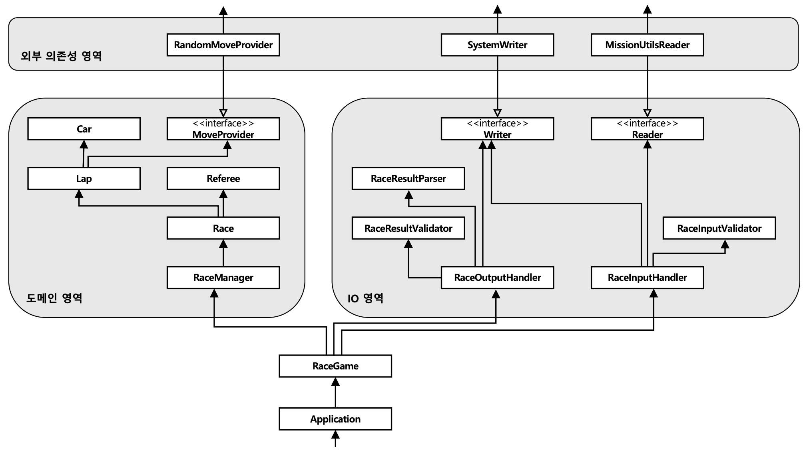

# 자동차 경주

> 자세한 기능 구현 목록은 README에 기재되어 있습니다!
>
> 아래에 '고민했던 지점'에 코드 구성의 이유가 적혀있습니다!

## 주요 클래스 다이어그램



## 디렉토리 구조

```text
main
 └── java
     └── racingcar
         ├── Application.java
         ├── RaceGame.java
         ├── config
         │   ├── RaceGameConfig.java
         │   ├── moveProvider
         │   │   ├── DefaultMoveProviderConfig.java
         │   │   └── MoveProviderConfig.java
         │   ├── reader
         │   │   ├── DefaultReaderConfig.java
         │   │   └── ReaderConfig.java
         │   └── writer
         │       ├── DefaultWriterConfig.java
         │       └── WriterConfig.java
         ├── constants
         │   ├── ExceptionMessages.java
         │   ├── InputMessages.java
         │   ├── OutputMessages.java
         │   └── StringConstants.java
         ├── domain
         │   ├── car
         │   │   ├── Car.java
         │   │   └── CarFactory.java
         │   ├── lap
         │   │   └── Lap.java
         │   ├── moveProvider
         │   │   ├── MoveProvider.java
         │   │   └── RandomMoveProvider.java
         │   ├── race
         │   │   ├── Race.java
         │   │   ├── RaceFactory.java
         │   │   └── RaceManager.java
         │   ├── randomProvider
         │   │   ├── MissionUtilsRandomAdapter.java
         │   │   └── RandomAdapter.java
         │   └── referee
         │       └── Referee.java
         ├── dto
         │   ├── CarStatus.java
         │   ├── LapResult.java
         │   ├── RaceRequest.java
         │   └── RaceResult.java
         └── io
             ├── RaceInputHandler.java
             ├── RaceInputValidator.java
             ├── RaceOutputHandler.java
             ├── RaceResultParser.java
             ├── RaceResultValidator.java
             ├── reader
             │   ├── MissionUtilsReader.java
             │   └── Reader.java
             └── writer
                 ├── SystemWriter.java
                 └── Writer.java
test
└── java
    └── racingcar
        ├── ApplicationTest.java
        ├── RaceGameTest.java
        ├── domain
        │   ├── car
        │   │   ├── CarTest.java
        │   │   └── CarFactoryTest.java
        │   ├── lap
        │   │   └── LapTest.java
        │   ├── race
        │   │   ├── RaceFactoryTest.java
        │   │   ├── RaceManagerTest.java
        │   │   └── RaceTest.java
        │   ├── randomProvider
        │   │   └── MissionUtilsRandomAdapterTest.java
        │   └── referee
        │       └── RefereeTest.java
        ├── io
        │   ├── RaceInputHandlerTest.java
        │   ├── RaceOutputHandlerTest.java
        │   └── RaceResultParserTest.java
        └── testutil
            ├── config
            │   ├── TestMoveProviderConfig.java
            │   ├── TestReaderConfig.java
            │   └── TestWriterConfig.java
            └── testdouble
                ├── MoveProviderFake.java
                ├── ReaderFake.java
                └── WriterFake.java
```

# 고민했던 지점

## 외부 의존성 처리

> 이번 자동차 경주는 Console, System, Randoms 클래스들을 사용해야만 처리할 수 있는 도메인이었습니다.
>
> 때문에 **'어떻게 해야 외부 의존성들이 내 도메인 객체를 더럽히는 것을 막을까?'** 라는 고민을 많이 했습니다.
>
> 여러 방법을 떠올렸지만 결국 **의존성역전**을 사용했습니다.

- 도메인은 RandomApater 인터페이스에만 의존합니다.
  - RandomApater의 구현체인 MissionUtilsRandomApater가 Randoms를 활용하여 이를 구현했습니다.
  - 테스트에서는 이를 쉽게 테스트 해볼 수 있습니다.
- io코드는 Reader 인터페이스에만 의존합니다.
  - Reader의 구현체인 MissionUtilsReader가 Console을 활용하여 이를 구현했습니다.
  - 테스트에서는 ReaderFake 테스트대역을 통해 미리 입력값을 세팅하고 쉽게 테스트 해볼 수 있습니다.
- io코드는 Writer 인터페이스에만 의존합니다.
  - Writer의 구현체인 SystemWriter가 System을 활용하여 이를 구현했습니다.
  - 테스트에서는 WriterFake 테스트대역을 통해 출력값을 뽑아서 검증해볼수 있습니다.
- 덕분에 헥사고날 아키텍처의 포트-어댑터 패턴과도 매우 유사하게 되었습니다.

## 신중한 클래스/메서드명 사용

> 1주차에 작성한 코드를 다시 보니, 클래스명이나 메서드명 만으로 확 다가오는 역할이 없었습니다.
>
> 이번 주차에서는 클래스명과 메서드명만으로 해당 객체가 무슨 역할을 하는지 바로 이해할 수 있도록 노력했습니다.

- 도메인 객체들의 역할이 명확합니다. Car, Lap, Race, Referee 등의 이름은 역할을 바로 떠올리게 합니다.

## 좋은 단위 테스트

> 1주차가 끝나고부터 프리코스 내에서 TDD 스터디를 하게 되었습니다. 여러 의견을 주고받고 시야를 늘리기 위해서 테스트 코드를 열심히 준비했습니다.
>
> 테스트 코드에서 가장 중요하게 생각했던 지점은 '좋은 단위 테스트'입니다. **잘 깨지지 않고, 회귀방지가 좋으며, 유지보수하기 쉬운 테스트**를 작성하려고 노력했습니다.

- 직접 만든 테스트대역들을 적극 활용하여 잘 깨지지 않는 테스트를 작성하였습니다.
  - Mockito를 일절 사용하지 않았습니다. Mockito같은 강력한 라이브러리에 의존하는 테스트 코드는 프로덕션 코드에 소위 '빨간불'을 밝히지 못한다고 생각했습니다.
  - Mockito 사용을 지양하면서 테스트가 어려운 지점을 객체지향적이지 못한 지점이라고 판단하며 전체적인 코드를 작성하였습니다.
- Config 파일을 분리하였습니다.
  - RaceGameConfig 내부에 다른 Config 파일들이 구성됩니다.
  - 따라서 테스트에서 특정 Config 파일만 갈아끼워서 테스트환경을 구성해볼 수 있습니다.
- 풍부한 단위 테스트가 작성된 후에는 통합 테스트도 작성하여 도메인 상호작용을 테스트합니다.